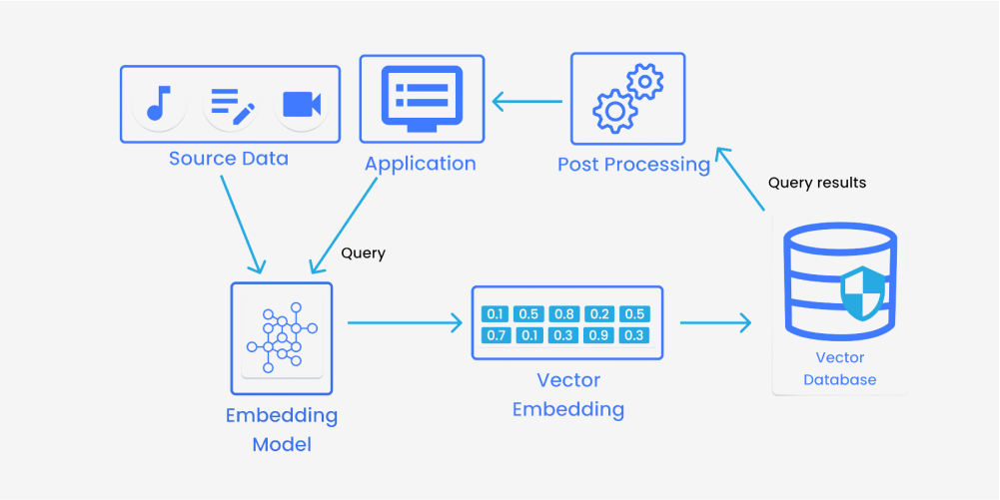
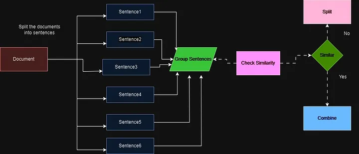

# RAG Employee Handbook Chatbot
## DEMO


[Watch the full video on YouTube]([https://youtu.be/qO9DAAGrzR4](https://youtu.be/4x8MaTNYkTY))
Este proyecto implementa un agente conversacional que responde preguntas sobre documentos PDF largos, usando el "Google Employee Handbook" como ejemplo. A través de técnicas de *Retrieval-Augmented Generation (RAG)*, el chatbot combina búsqueda y generación de respuestas basadas exclusivamente en el contenido del manual. El objetivo es facilitar consultas rápidas y precisas sobre políticas y procedimientos del manual, optimizando el acceso a información corporativa clave en documentos extensos como el del ejemplo que cuenta con más de 60 paginas.

### Componentes Clave

- **Base de Datos Vectorial (Pinecone)**: Pinecone almacena y busca fragmentos relevantes del manual en forma de vectores, permitiendo búsquedas semánticas precisas.
  
- **División Semántica del Texto**: Se utiliza *semantic chunking* para dividir el texto en fragmentos coherentes, facilitando respuestas más exactas.
  
- **Modelos de OpenAI**: Modelos como *GPT-3.5* o *text-embedding-ada-002*, para generar respuestas utilizando los fragmentos recuperados, o pasar a embedding los distintos fragmentos del texto, los cuales permiten responder a las preguntas del manual.

## ¿Qué es RAG?

*Retrieval-Augmented Generation* (RAG) es una técnica de procesamiento de lenguaje natural que combina dos capacidades fundamentales: la **recuperación** de información y la **generación de respuestas**. 

En un sistema RAG:
1. **Recuperación**: Primero, el sistema busca fragmentos de información relevantes en una base de datos vectorial (como Pinecone) basada en la similitud semántica entre las preguntas y los datos almacenados.
2. **Generación**: Luego, un modelo generativo, como GPT-3.5, utiliza los fragmentos recuperados como contexto para construir una respuesta informada y específica a la pregunta.

Este enfoque permite que el modelo responda a preguntas complejas utilizando información actualizada y específica, incluso cuando el contenido de la respuesta no está integrado directamente en los parámetros del modelo. RAG es ideal para aplicaciones donde es fundamental responder basándose en datos precisos y extensos, como en el caso de este proyecto, que consulta un manual de empleados extenso.
<p align="center">
  
</p>

## Embeddings

Los *embeddings* son representaciones vectoriales de texto que capturan el significado semántico de palabras, frases o fragmentos de texto de forma numérica. En el contexto de este proyecto, los embeddings son fundamentales para comparar la similitud entre las consultas del usuario y los fragmentos del documento, permitiendo que el chatbot identifique las respuestas relevantes en el manual de empleados.

### Cómo Funcionan los Embeddings

Cada fragmento de texto se convierte en un vector, que es un conjunto de números que representan el contenido semántico de ese fragmento. Al calcular la similitud entre el vector de la pregunta del usuario y los vectores de cada fragmento del documento, se puede identificar el fragmento que más se asemeja al contenido de la pregunta.

### Modelo Utilizado

En este proyecto se utiliza el modelo `text-embedding-ada-002` de OpenAI, que genera un vector de 1536 dimensiones para cada fragmento. Este modelo es eficiente en cuanto a costo y precisión, lo que lo hace ideal para tareas de búsqueda y recuperación de información en bases de datos vectoriales.

## Bases de Datos Vectoriales

Una base de datos vectorial es una herramienta diseñada para almacenar y buscar información en forma de vectores, permitiendo consultas rápidas y eficientes basadas en la similitud semántica del contenido. En este proyecto, utilizamos **Pinecone** como base de datos vectorial para almacenar los embeddings de los fragmentos del manual de empleados, facilitando así la búsqueda de información relevante en respuesta a las consultas del usuario.

### Configuración de la Base de Datos en Pinecone

La configuración del índice en Pinecone incluye los siguientes parámetros:

- **Nombre del índice**: El índice tiene un nombre específico que facilita su identificación y manejo.
- **Dimensiones del vector**: Cada vector tiene 1536 dimensiones, que es el tamaño del embedding generado por el modelo `text-embedding-ada-002` de OpenAI. Este número de dimensiones permite capturar patrones y relaciones semánticas complejas, lo que mejora la precisión de las búsquedas al representar conceptos abstractos y contextuales.
- **Métrica de similitud**: Se utiliza la similitud coseno en lugar de otras métricas. La similitud coseno mide el ángulo entre dos vectores en un espacio multidimensional, lo cual es ideal cuando se desea evaluar la similitud de contenido sin considerar la magnitud de los vectores. Esta métrica es particularmente adecuada para embeddings de texto, donde la similitud semántica es más importante que la escala.

### Implementación en el Proyecto

1. **Inicialización de Pinecone**: Se carga la clave de API de Pinecone y se establece una conexión con el servicio, permitiendo el acceso y uso de las funcionalidades de la base de datos vectorial.

2. **Creación del Índice**: El índice se configura con el nombre específico, la cantidad de dimensiones y la métrica de similitud coseno. Este índice almacena cada fragmento del manual de empleados junto con su embedding, lo que permite realizar búsquedas basadas en la similitud semántica de manera rápida y precisa.

3. **Búsqueda de Fragmentos Relevantes**: Cuando el usuario hace una pregunta, el sistema genera un embedding de la consulta y lo compara con los embeddings en Pinecone. Los fragmentos con mayor similitud coseno se seleccionan como los más relevantes para responder la consulta del usuario.

### Ventajas de Usar Pinecone con Similitud Coseno

La configuración de Pinecone con similitud coseno y 1536 dimensiones proporciona:

- **Precisión en la búsqueda**: La similitud coseno permite encontrar fragmentos de texto con significados similares, mejorando la relevancia de las respuestas.
- **Optimización para consultas semánticas**: La estructura de Pinecone permite manejar grandes volúmenes de datos y consultas en tiempo real, lo que asegura respuestas rápidas y contextualmente relevantes basadas en el contenido del manual de empleados.

Esta configuración permite que el chatbot responda con precisión y eficiencia a preguntas complejas, aprovechando al máximo la estructura semántica del documento original.
<p align="center">
  
</p>
## Chunking

*Chunking* es el proceso de dividir un texto largo en fragmentos más pequeños y manejables para facilitar la búsqueda y recuperación de información. Existen varias técnicas de chunking, cada una con sus ventajas y limitaciones.

### Tipos de Chunking

1. **Fixed Size Chunking**: Este método divide el texto en fragmentos de tamaño fijo en función de un número determinado de tokens, y opcionalmente añade un solapamiento entre fragmentos para mantener el contexto. Es una opción popular debido a su simplicidad y bajo coste computacional, pero puede interrumpir ideas y perder coherencia semántica.

2. **Recursive Chunking**: Utiliza un enfoque jerárquico para dividir el texto en fragmentos mediante un conjunto de separadores. Si la primera división no logra el tamaño o estructura deseados, se aplica recursivamente con diferentes criterios. Este método permite una mejor estructura de los fragmentos que se ajusta a diferentes tamaños, aunque puede requerir más procesamiento.

3. **Document Specific Chunking**: Este enfoque considera la estructura del documento, creando fragmentos basados en secciones lógicas como párrafos o subsecciones. Es ideal para documentos estructurados, ya que respeta la organización original del autor y es particularmente útil para formatos con estructura clara, como HTML o Markdown.

4. **Semantic Chunking**: A diferencia de los métodos anteriores, el *semantic chunking* se basa en el significado y las relaciones contextuales del texto. En lugar de dividir el texto en función de la longitud o de secciones predefinidas, agrupa oraciones que son semánticamente similares en fragmentos completos de ideas. Esto se logra calculando los embeddings de cada oración y luego agrupando las oraciones que son semánticamente cercanas.

### Funcionamiento del Semantic Chunking

El proceso de *semantic chunking* implica los siguientes pasos:

- **Separación en Oraciones**: El documento se divide en oraciones individuales, utilizando puntuaciones como puntos, signos de interrogación y signos de exclamación como separadores.
  
- **Generación y Comparación de Embeddings**: Se generan embeddings para cada oración y se calcula la similitud entre las oraciones para identificar relaciones semánticas cercanas.
  
- **Agrupación de Oraciones**: Las oraciones se agrupan basándose en su proximidad semántica. Se añade un “buffer” de oraciones cercanas para cada grupo seleccionado, creando fragmentos que son contextualmente completos y coherentes.

- **Fusión y División de Grupos**: Los grupos de oraciones similares se fusionan para formar fragmentos significativos y se dividen aquellos que no comparten una relación semántica fuerte, manteniendo la coherencia de cada fragmento.
<p align="center">
  
</p>
### Ventajas del Semantic Chunking

*Semantic chunking* ofrece ventajas importantes frente a otros métodos de chunking:

- **Contexto Completo y Coherente**: A diferencia de los fragmentos de tamaño fijo o los fragmentos basados en secciones predefinidas, cada fragmento creado mediante *semantic chunking* mantiene la integridad del contenido. Esto significa que las respuestas generadas a partir de estos fragmentos son más precisas y contextualmente relevantes.

- **Mejora en la Precisión de Recuperación**: Al crear fragmentos basados en la relación semántica de las oraciones, el *semantic chunking* reduce las interrupciones en las ideas y mejora la relevancia de las respuestas. Esto es particularmente útil para consultas complejas donde la integridad semántica del texto es clave.

- **Ideal para Documentos No Estructurados**: En documentos extensos sin una estructura clara (como artículos largos o documentos extensos), el *semantic chunking* permite agrupar el contenido en unidades significativas, superando las limitaciones de los métodos basados en tamaño o en estructura.

## Tutorial de Uso

Sigue estos pasos para configurar y ejecutar el chatbot del manual de empleados.

### Paso 1: Configura las API Keys

Crea un archivo `.env` en el directorio raíz del proyecto e incluye las claves de OpenAI y Pinecone:

```plaintext
OPENAI_API_KEY = 'tu_openai_api_key'
PINECONE_API_KEY = 'tu_pinecone_api_key'
```

### Paso 2: Procesa el Documento y Crea la Base de Datos Vectorial

Ejercuta el archivo embedding.py indicando la funcion main la ruta del archivo pdf y el nombre deseado para la base de datos vectorial
```bash
python embedding.py
```
### Paso 3: Ejecuta la Aplicación en Streamlit
Inicia la interfaz de usuario con el siguiente comando para empezar a interactuar con el bot
```bash
streamlit run app.py
```
